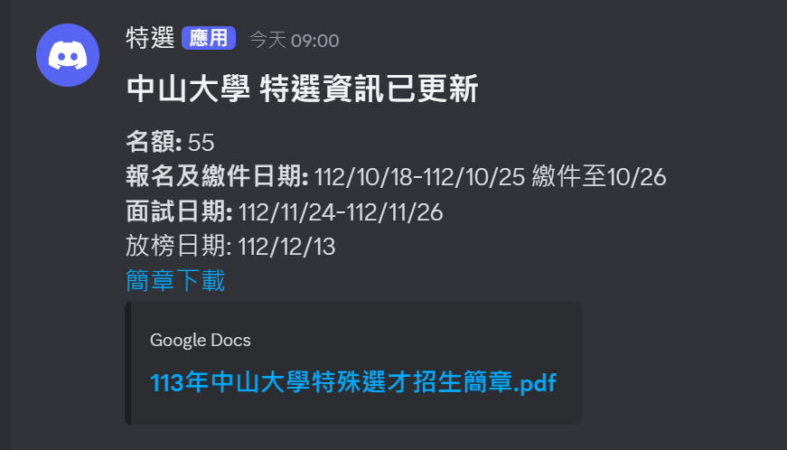

# 特選簡章 Discord 通知

每小時去 [甄戰](https://www.reallygood.com.tw/newExam/inside?str=932DEFBF9A06471E3A1436C3808D1BB7) 看一下簡章有沒有更新。

## 如何使用

1. **留下一顆星星**。你懂的。
2. **Fork 這個專案**，右上角那個。
3. **設定 Secrets**
   
   在你的專案頁面點選 `Settings` -> `Secrets` -> `actions` -> `Repository secrets`，新增 Secrets：
   - `WEBHOOK_URL`: Discord Webhook URL。請到你的 Discord 伺服器設定 --> 整合 --> Webhook --> 新 Webhook，複製 Webhook URL。